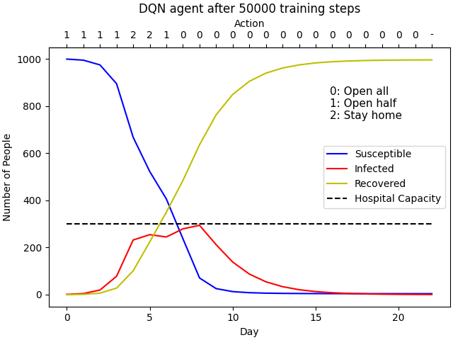

# COVID19_RL

## Setup
The following setup was used in context of macOS   

Python version 3.7.8   
R version 4.0.2   

After cloning the GitHub repository, create virtual environment and install the
required packages:   
```console
$ python3 -m venv venv
$ source venv/bin/activate
$ pip install -r requirements.txt
```  

If rpy2 has been installed correctly, you can now install the required R
packages using the following python script:
```console
$ python installing_packages.py
```  

Now you should be able to run any program in this repository. If you notice any missing python package that is needed, please add it to [requirements.txt](requirements.txt). Similarly, if you notice any R packages that are missing, add them to the `packnames` list in [installing_packages.py](installing_packages.py).

## COVID19_agents
This folder contains agents that train on COVID19_env environments. The first is a DQN agent from Stable Baselines ([DQN_simple_SIR.py](COVID19_agents/DQN_simple_SIR.py)). To train this agent and test it on the simple SIR environment, simply run the python script:
```console
$ cd COVID19_agents
$ python DQN_simple_SIR.py
```   

Stable Baselines agents support the use of Tensorboard to monitor results. To monitor training progress while training an agent, run the following in a separate terminal:
```console
$ tensorboard --logdir ./DQN_SIR_tensorboard/
```  
In general, replace './DQN_SIR_tensorboard/' with whatever name is specified for `tensorboard_log` in the agent's `.py` file.

#### Files
- [DQN_simple_SIR.py](COVID19_agents/DQN_simple_SIR.py) trains a Stable Baselines DQN agent on the `simple_SIR_env` environment.


## COVID19_env
This folder contains RL environments for COVID-19, which are used to train COVID19_agents.  

These environments are written in Python but utilize dynamics models written in
R (e.g. simple_SIR_model.R). The conversions between Python and R are handled by `rpy2`. See the [rpy2_examples](rpy2_examples/) folder for examples and the following website for more documentation: https://rpy2.github.io/doc/latest/html/index.html

#### Files
- [check_env.py](COVID19_env/check_env.py) uses a Stable Baselines function, `check_env`, to check that a given custom environment follows the gym interface
- [simple_SIR_env.py](COVID19_env/simple_SIR_env.py) is an environment that uses dynamics defined by `simple_SIR_model.R` to simulate the cost (health cost + economic cost) for a given action (open everything, open halfway, stay at home) in a given state (SIR totals).

## Results
This folder contains images/plots of training results.
See DQN_simple_SIR_results#.png, where the # is the number of  training episodes.  

Most recent result:



#### Files
- `DQN_simple_SIR_results#.png` shows a `DQN_simple_SIR.py` agent performance during one simulated episode in the `simple_SIR_env.py` environment after the agent has trained for # training steps.
- [DQN_SIR_reward_results.png](Results/DQN_SIR_reward_results.png) shows the progress of a `DQN_simple_SIR.py` agent in the `simple_SIR_env.py` environment during training

## COVID19_models
This folder contains COVID19 spread models in R to be used in the RL environments. The purpose of this folder is to have a place to test the R files before they are integrated into the RL environments.  

A simple SIR model is implemented in SIR_example.R and can be tested by running call_model.py.
```console
$ cd COVID19_models
$ python call_model.py
```

#### Files
- [call_model.py](COVID19_models/call_model.py) calls `SIR_example.R` to test it as a stand-alone model
- [SIR_example.R](COVID19_models/SIR_example.R) is an R implementation of an SIR model of disease spread (source: https://rpubs.com/choisy/sir)

## rpy2_examples
This folder is to test rpy2, such as calling custom R functions.     
The custom R functions are located in testFunc.R. They are called by running the Python file call_testFunc.py.
```console
$ cd rpy2_examples
$ python call_testFunc.py
```

rpy2 docuentation: https://rpy2.github.io/doc/latest/html/index.html

#### Files
- [call_testFunc.py](rpy2_examples/call_testFunc.py)
- [print_version.py](rpy2_examples/print_version.py)
- [testFunc.R](rpy2_examples/testFunc.R)

## stable_baselines_examples
This folder contains relevant Stable Baselines RL examples for reference when
working on our COVID-19 RL implementation.  

*Note:* When using Stable Baselines, you may get many warnings about future versions of some python packages, but from my experience, you can ignore these warnings. I will work on resolving this.  

Stable Baselines documentation: https://stable-baselines.readthedocs.io/en/master/  


#### Files
- [customEnv_skeleton.py](stable_baselines_examples/customEnv_skeleton.py)
- [DQN_CartPole.py](stable_baselines_examples/DQN_CartPole.py)
- [soccer_env_example.py](stable_baselines_examples/soccer_env_example.py)
